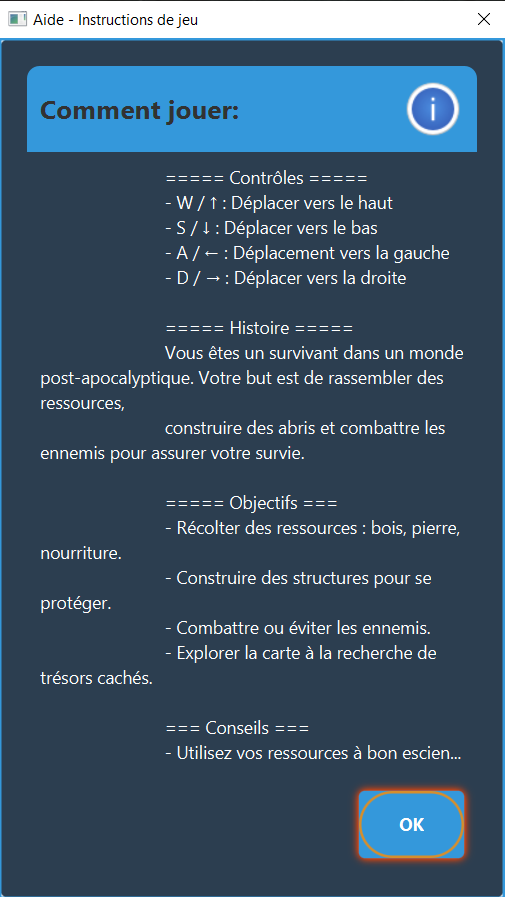
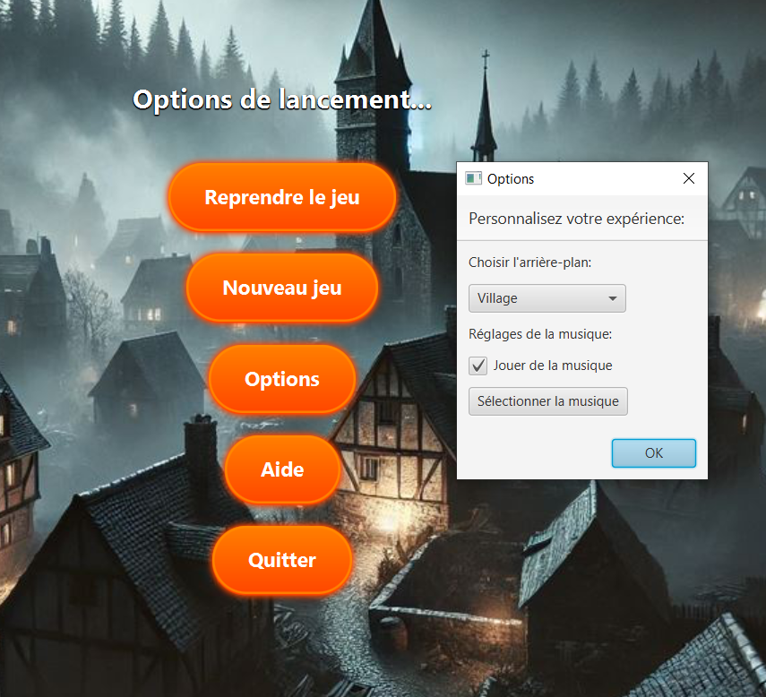
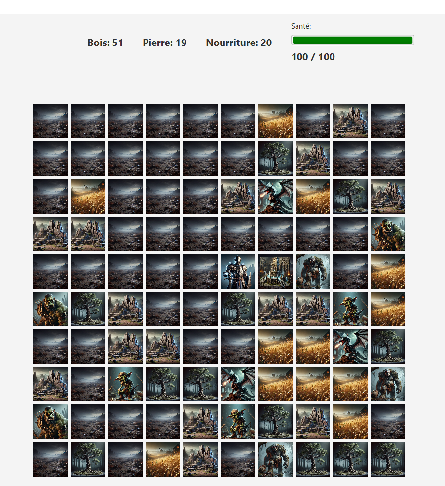
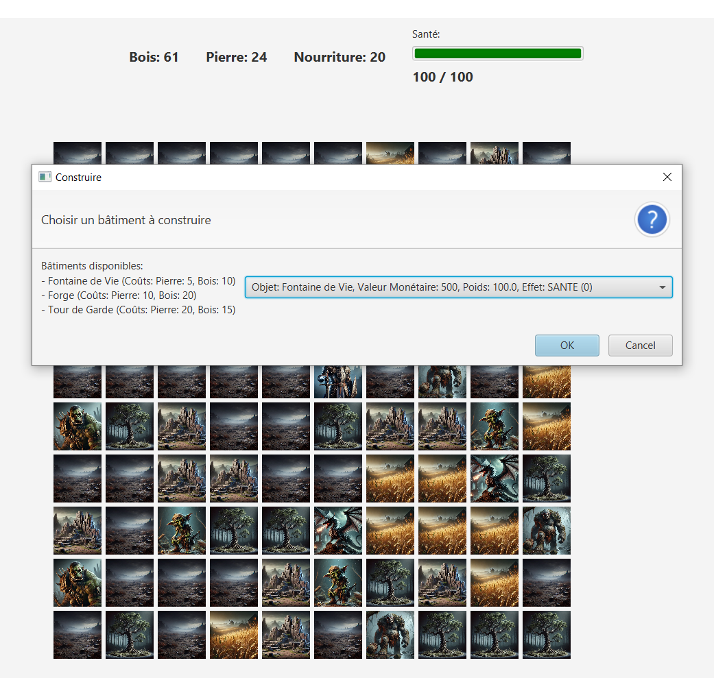
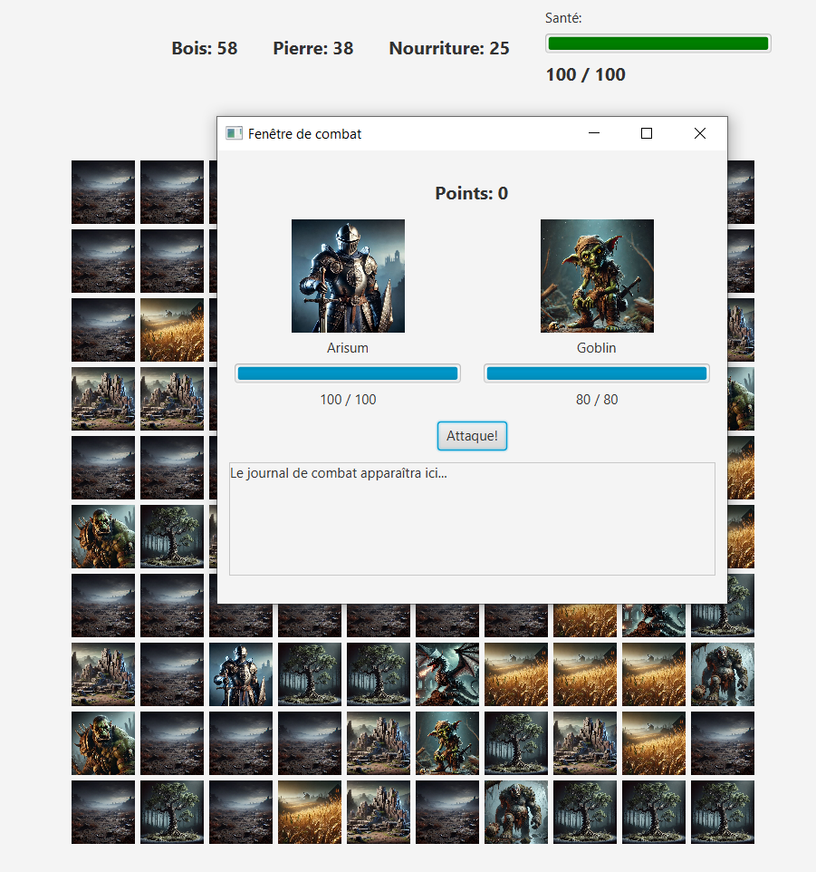
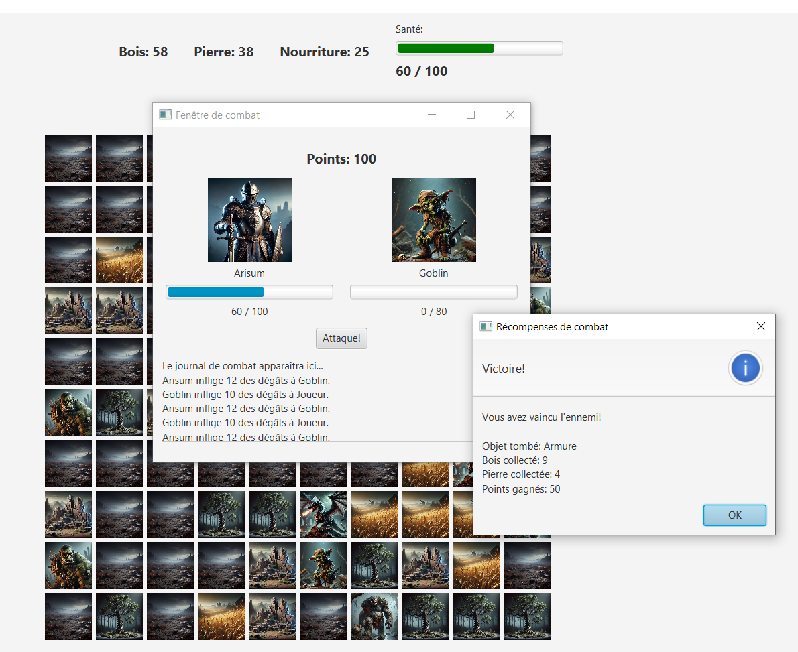
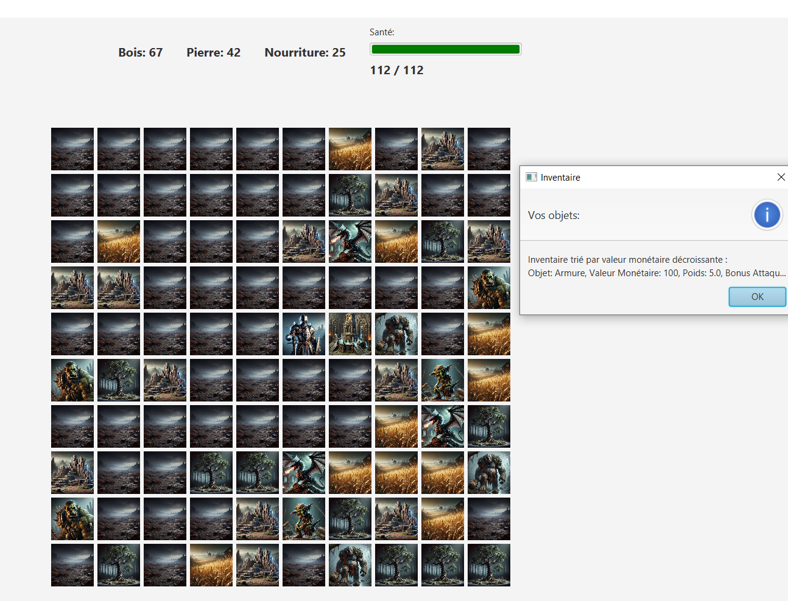
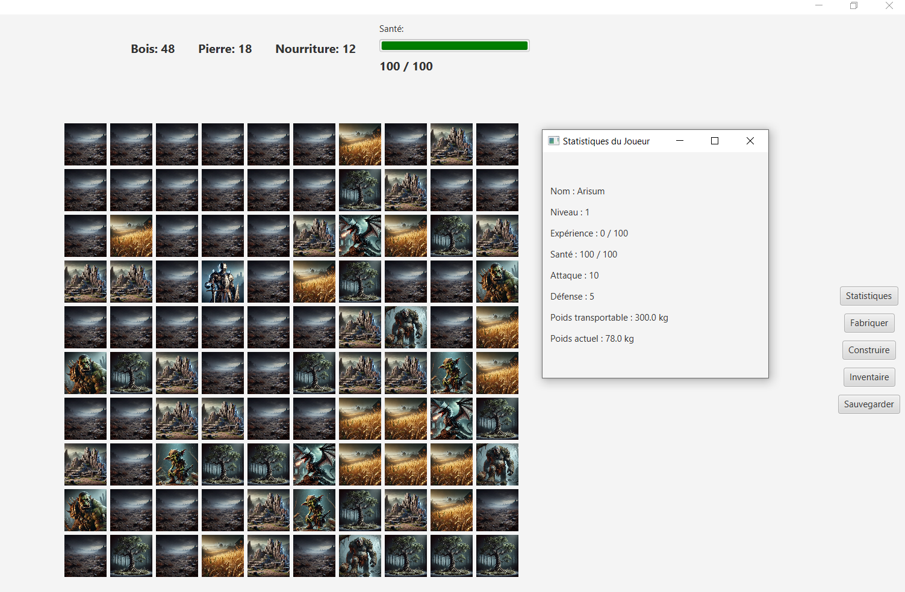

<h1 align="center">2D Survival Game</h1>

  <strong>Grid-based survival game developed in Java with JavaFX</strong> 
  Real-time movement, resource gathering, crafting, building, combat and save/load support

  
  
  
  

  <strong>Author:</strong> Aris-Georgian ILIE

---

## TABLE OF CONTENTS

- [ABOUT THE PROJECT](#about-the-project)
- [GAME CONCEPT](#game-concept)
- [MAIN GAMEPLAY LOOP](#main-gameplay-loop)
- [CORE FEATURES](#core-features)
- [GAME SYSTEMS IN DETAIL](#game-systems-in-detail)
  - [Main Menu and Launch Flow](#main-menu-and-launch-flow)
  - [Grid Map and Player Movement](#grid-map-and-player-movement)
  - [Resources and Gathering](#resources-and-gathering)
  - [Crafting and Building](#crafting-and-building)
  - [Combat System](#combat-system)
  - [Inventory and Item Management](#inventory-and-item-management)
  - [Player Statistics and Progression](#player-statistics-and-progression)
  - [Save and Load System](#save-and-load-system)
  - [Options and Help Interface](#options-and-help-interface)
- [SCREENSHOTS](#screenshots)
- [CONTROLS](#controls)
- [TECHNICAL ARCHITECTURE](#technical-architecture)
- [OBJECT-ORIENTED DESIGN](#object-oriented-design)
- [TECHNOLOGIES USED](#technologies-used)
---

## ABOUT THE PROJECT

<strong>2D Survival Game</strong> is an interactive survival project developed in <strong>Java with JavaFX</strong>. The game takes place on a grid-based map where the player moves using the keyboard, gathers resources, fights enemies, crafts equipment, builds useful structures and manages survival over time. The project combines game logic from object-oriented programming with a graphical user interface that updates in real time as the player interacts with the world.

The game was designed as a full playable application rather than a small technical demo. It includes a launch menu, a game map, combat windows, building and inventory interfaces, player statistics, help and options panels and a save/load system that allows the player to continue from a previously saved state.

Every new session can generate a fresh randomized map, which means the distribution of resources and enemies changes from game to game. As the player moves across the matrix, the interface reacts immediately. If a resource is collected, that tile becomes empty. If a structure is built, that tile becomes occupied. If an enemy is encountered, a dedicated combat window opens and the result of the fight affects the main game state.

The project also puts strong focus on clean object-oriented structure. It uses abstract classes, inheritance, enums, interfaces, exceptions, file operations and inventory sorting through comparison logic. Because of that, the game works both as an interactive survival experience and as a solid academic software project built around OOP principles.

---

## GAME CONCEPT

The idea behind the game is to place the player in a hostile environment where survival depends on movement, resource management and decision making. The world is represented as a matrix of cells. Some cells are empty, some contain resources and some contain enemies or special objects. The player moves one cell at a time and must decide how to use the available space and materials.

The player collects the main resources needed for survival and progression: <strong>wood</strong>, <strong>stone</strong> and <strong>food</strong>. These resources are important because they support multiple systems in the game. They allow the player to build structures, craft useful items and maintain progress while exploring the map.

The game is not only about collecting. It also introduces danger through enemies placed on the map. When the player reaches an enemy tile, combat begins in a separate battle interface. Winning these fights can reward the player with points, dropped items and additional resources. Losing can reduce health or end progress, depending on the situation.

Because movement, gathering, combat, crafting and building are all connected, the game creates a complete loop where each action matters. The player is constantly choosing whether to explore, fight, invest in structures or preserve resources for later use.

---

## MAIN GAMEPLAY LOOP

The gameplay loop is structured around exploration and survival on a dynamic 2D map.

At the beginning of a new game, the player enters a randomly generated map. The grid contains a mixture of empty cells, resource nodes and enemies. Using the <strong>W</strong>, <strong>A</strong>, <strong>S</strong> and <strong>D</strong> keys, the player moves through the map one tile at a time and interacts with what is found in the environment.

When the player reaches a resource tile, the resource can be collected and added to the player's totals. The tile then changes visually to an empty cell, which gives immediate feedback that the interaction was successful.

When the player reaches an empty tile, that space can be used strategically. The player may decide to build a structure there or keep moving. Structures provide long-term utility and can improve survivability through healing, defense or other gameplay effects.

When the player reaches an enemy, the game opens a separate combat scene or window. The player and the enemy exchange attacks until one of them is defeated. The outcome affects health, score, dropped rewards and the player's future decisions.

This loop continues throughout the session.

1. explore the map  
2. collect resources  
3. manage health and items  
4. fight enemies when necessary  
5. build structures on empty cells  
6. improve long-term survival through planning and resource use  

Because all of these systems update the interface immediately, the player always sees the direct consequences of movement and actions.

---

## CORE FEATURES

### Real-time grid-based movement

The player moves across a matrix-based world using keyboard input. Each movement changes position on the grid and updates the interface in real time.

### Randomized map generation

Each new game creates a different map layout with randomized placement of resources and enemies, which makes repeated sessions less predictable.

### Resource gathering

The player can collect wood, stone and food from dedicated map tiles. Gathered resources are immediately reflected in the interface.

### Crafting and building

Empty cells can be used to create new objects or construct structures that provide useful gameplay effects and strategic benefits.

### Separate combat interface

When the player encounters an enemy, a dedicated combat window opens and displays the battle flow, health values and reward outcomes.

### Inventory management

Collected and dropped items are stored in an inventory system that can be displayed and sorted according to selected criteria such as value.

### Player statistics

The game tracks important player data including health, attack, defense, experience, carrying capacity and current carried weight.

### Save and load support

The current game state can be saved to files and loaded later so the player can continue from the same position with the same resources and inventory.

### Full GUI flow

The project includes a main menu with Resume, New Game, Options, Help and Exit, as well as multiple secondary windows for gameplay features.

---

## GAME SYSTEMS IN DETAIL

### Main Menu and Launch Flow

The game begins with a full menu interface that acts as the entry point to the application. From this screen, the player can start a new randomized game, resume a previous session, open the options menu, read the help instructions or exit the application.

This launch structure is important because it makes the project feel complete and user-oriented. Instead of opening directly into gameplay, the application behaves like a full game with a proper starting flow and multiple player-facing options.

The resume feature is especially useful because it connects the menu to the save/load system. This makes the game practical to revisit and also demonstrates file reading functionality in a meaningful gameplay context.

---

### Grid Map and Player Movement

The main game world is represented as a square matrix where each tile contains one type of content: empty space, a resource, an enemy or a constructed structure.

The player moves using the standard <strong>W</strong>, <strong>A</strong>, <strong>S</strong> and <strong>D</strong> keys. Each move changes the current grid position by one cell. This movement system is simple to understand, but it is central to the whole project because almost every gameplay mechanic depends on which tile the player is currently occupying.

The interface reacts immediately when the player moves. If the new tile contains a resource, the collection effect becomes visible. If it contains an enemy, the combat sequence starts. If it is empty, the player may use it for building or simply continue exploring.

This direct relationship between tile position and game state makes the map system very clear and effective for a survival game built around interaction and progression.

---

### Resources and Gathering

The main collectible resources are <strong>wood</strong>, <strong>stone</strong> and <strong>food</strong>. They are represented on the map through different visual elements, which makes it possible for the player to identify them directly from the interface.

When the player reaches one of these tiles, the resource is collected and added to the player's total. The interface updates instantly, and the tile becomes empty to show that the object has been consumed or removed from the world.

This system is important because it gives the player a reason to explore and a practical reward for movement. Resources are not decorative. They are used later for crafting and construction, which means gathering has lasting impact on gameplay.

The game also treats resource collection as part of strategy. Choosing whether to gather immediately, continue exploring or prepare for combat creates small but meaningful decisions throughout the session.

---

### Crafting and Building

One of the more interesting parts of the project is the ability to use empty map cells for construction. If the player stands on or reaches an empty tile, that space can become the location for a crafted structure.

Buildings are more than static decorations. They have gameplay effects and can change how the player survives. For example, a healing structure can restore health, while other buildings may improve defensive or combat-related statistics. This makes construction feel useful rather than cosmetic.

Building also introduces resource planning. The player must decide how much wood and stone to spend and whether the chosen location is worth occupying permanently. Since placed buildings take up space on the matrix, each construction decision changes the future shape of the map.

The building system therefore adds long-term planning to the game and connects resource gathering to progression in a natural way.

---

### Combat System

Combat happens when the player moves onto a tile occupied by an enemy. Instead of resolving the fight invisibly, the game opens a dedicated combat window that clearly presents both participants, their health values and the battle log.

The player attacks first, after which the enemy responds. This exchange continues until one side is defeated. Because the battle is displayed in its own window, the player can follow the action step by step and understand exactly how the fight develops.

The result of combat affects several systems at once. Health can decrease, points can increase and the player may obtain dropped items or additional resources after a victory. This makes combat an important source of both danger and reward.

The reward window shown after battle helps reinforce progression. It gives a clear summary of what was gained from the encounter and makes each victory feel meaningful.

---

### Inventory and Item Management

The inventory stores items gathered during exploration or dropped by defeated enemies. These items can improve the player through bonuses such as better attack, defense or other stat-related advantages.

The system is more than a simple storage list. Items can be displayed through a dedicated inventory interface, and sorting logic can be applied to organize them based on selected criteria such as monetary value. This reflects the use of comparison-based programming techniques inside the project and gives the inventory a stronger technical foundation.

Inventory management matters because it supports both the survival and progression sides of the game. Valuable items improve the player, while clear display and sorting help keep the state understandable and structured.

---

### Player Statistics and Progression

The game tracks a set of player statistics that influence survival and combat. These include health, attack, defense, level, experience, carrying capacity and current weight.

Displaying this information in a separate statistics interface helps the player understand their current condition and progress. It also makes the game feel more complete because the player is not only moving on a map, but developing a character with measurable strengths and limitations.

Carrying capacity is especially useful in a survival game because it adds a practical constraint to inventory use. It encourages planning and prevents item collection from becoming meaningless accumulation.

---

### Save and Load System

The game includes persistent save and load functionality through file input and output. This allows the current session to be stored and reopened later with the same map state, player position, resource totals and inventory contents.

This feature is important both technically and practically. From a software perspective, it demonstrates meaningful file handling. From a gameplay perspective, it makes the project easier to use, because players do not need to restart every time they close the application.

The Resume option in the main menu is directly connected to this system, which helps integrate persistence naturally into the overall user experience.

---

### Options and Help Interface

The project includes secondary interfaces that improve usability and presentation. The <strong>Options</strong> window allows changes such as background selection and music preferences, which helps personalize the experience.

The <strong>Help</strong> window explains the controls, story context and game objectives. This is especially useful for first-time users because it gives them immediate guidance without needing external documentation.

Together, these panels make the project more polished and accessible. They show that the game is designed not only to function technically, but also to communicate clearly with the player.

---

## SCREENSHOTS

### Main Menu

  

The main menu is the entry point of the application. It provides access to the core actions of the game: starting a new session, resuming a saved one, opening the options panel, reading the help section and closing the application.

### Help Window

  

The help interface explains the controls, the game context and the player's objectives. It makes the project easier to understand for someone who launches it for the first time.

### Options Window

  

The options panel allows basic customization of the experience, including visual background selection and music-related settings.

### Main Map View

  

This screenshot shows the main gameplay grid, the real-time resource display and the side action buttons. It illustrates how the player experiences the map during normal exploration.

### Building Interface

  

The construction window allows the player to choose which structure to build on an empty tile and displays the associated costs and effects.

### Combat Window

  

Combat takes place in a separate interface where the player and enemy face each other directly. Health bars and the battle log help make the fight easy to follow.

### Combat Rewards

  

After victory, the game shows a reward summary including dropped items, collected resources and earned points. This makes combat outcomes clear and satisfying.

### Inventory Window

  

The inventory interface displays the player's collected items and shows how they can be organized through sorting logic.

### Statistics and Inventory on Map

  

This screenshot shows the in-game map together with secondary management windows such as player statistics and inventory-related information. It illustrates how gameplay data remains visible and accessible while playing.

---

## CONTROLS

| Action | Input |
|---|---|
| Move up | `W` or `↑` |
| Move down | `S` or `↓` |
| Move left | `A` or `←` |
| Move right | `D` or `→` |
| Interact with map cell | Movement onto the target tile |
| Open menu-related features | Use on-screen buttons |

---

## TECHNICAL ARCHITECTURE

The project is built as a modular Java application where gameplay logic and interface logic work together.

The <strong>game state layer</strong> stores the player, map, resources, enemies, structures, score and progression data.

The <strong>map layer</strong> represents the world as a matrix and handles the content of each tile, including resources, buildings, enemies and empty cells.

The <strong>character layer</strong> manages the player and enemy entities, their stats and the rules for taking and dealing damage.

The <strong>inventory and item layer</strong> handles item ownership, sorting, bonuses and item display logic.

The <strong>GUI layer</strong> presents the menu, map, combat windows, help, options, construction and inventory interfaces using JavaFX.

The <strong>persistence layer</strong> manages save and load operations through file reading and writing.

This separation makes the project easier to maintain and helps demonstrate clean OOP design rather than mixing all responsibilities inside a single class.

---

## OBJECT-ORIENTED DESIGN

A major strength of the project is its use of object-oriented programming principles.

The game logic is built around <strong>abstract classes</strong> that generalize important concepts such as characters and gatherable objects. This allows shared behavior to be defined once and specialized in subclasses such as player, enemy or specific resource types.

<strong>Inheritance</strong> is used to structure related gameplay entities. This makes the code more organized and avoids unnecessary duplication.

<strong>Enums</strong> are used for controlled values such as quality or category, which helps keep the system safer and easier to understand.

<strong>Interfaces</strong> are used where behavior should be defined independently from a single class hierarchy.

<strong>Exceptions</strong> help handle invalid actions and edge cases cleanly, preventing the application from crashing when commands are not valid.

The inventory also demonstrates the use of <strong>Comparable</strong> or <strong>Comparator</strong> logic for sorting items according to meaningful properties such as value.

Together, these choices make the project academically solid and technically well structured.

---

## TECHNOLOGIES USED

| Technology | Role in the project |
|---|---|
| **Java** | Main programming language |
| **JavaFX** | GUI framework for scenes, windows and controls |
| **Object-Oriented Programming** | Core design approach for classes and gameplay logic |
| **File I/O** | Save and load game state |
| **Abstract Classes** | Generalization of shared game entities |
| **Inheritance** | Extension of base classes into specialized gameplay objects |
| **Enums** | Controlled categorical values |
| **Interfaces** | Reusable behavior contracts |
| **Exceptions** | Safe handling of invalid or extreme cases |
| **Comparable / Comparator** | Inventory sorting and ordering logic |
| **CSS / JavaFX Styling** | Visual customization of the interface |

---
